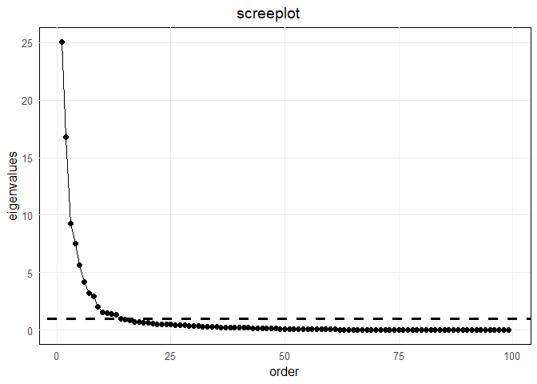
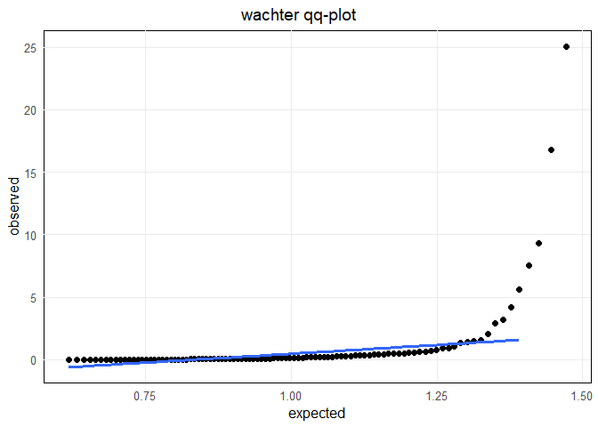
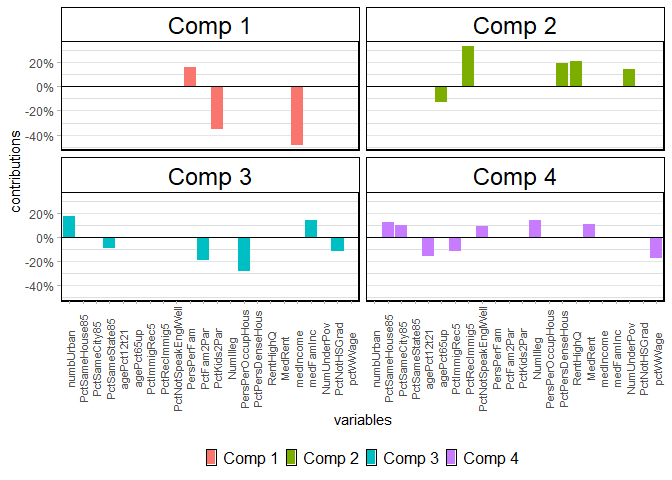
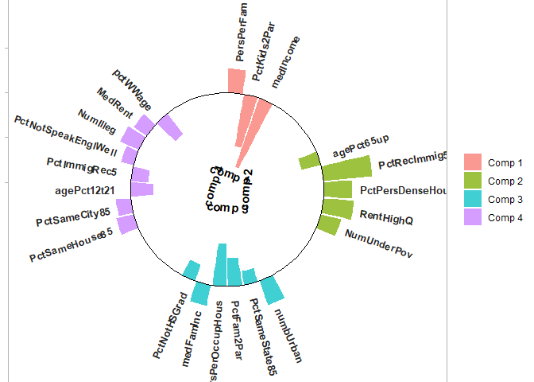

<!-- README.md is generated from README.Rmd. Please edit that file -->

# Package PMlsspca

<!-- badges: start -->

[](https://github.com/merolagio/PMlsspca/actions/workflows/R-CMD-check.yaml)
[](LICENSE)
[](https://doi.org/10.5281/zenodo.18829364)
[](https://lifecycle.r-lib.org/articles/stages.html)
[]()
<!-- badges: end -->

The goal of PMlsspca is to help reproduce the Least Squares Sparse
Principal Components Analysis (LS SPCA) examples in the paper published
in …………… The main function is lsspca(). Methods are print, summery and
plot. Functions are new.spca (to create an \`spca’ object from a set of
loadings and aggregate_by_scale to visualize the contribution by scale.

## Installation

You can install the development version of PMlsspca from
[GitHub](https://github.com/) with:

``` r
# `remotes' is the lightest alternative
install.packages("remotes")
remotes::install_github("merolagio/PMlsspca")
#or
#install.packages("devtools")
devtools::install_github("merolagio/PMlsspca")
# or
# install.packages("pak")
pak::pak("merolagio/PMlsspca")
```

## Example

This is a basic example which shows you how to compute basic LSSPCA
solutions:

\###load data

``` r
library(PMlsspca)
## basic example code
data(crime_data)
```

### Decide the number of components

``` r
cr_r = cor(crime_data)
cr_ee = eigen(cr_r)
screeplot(cr_ee$value, kaiser_line = T)
```



``` r
wachterqq(cr_ee$values, p = ncol(crime_data), n = nrow(crime_data), nfit_line = -4)
```



\###Compute PCA

``` r
mypca = pca(crime_data, ncomp = 4)
```

\###Compute the sparse loadings Important parameters are $`\alpha`$ the
minimum $`R^2`$, *ncomp* the number of components to compute, *method*
the LSSPCA to use (“u” for unicrrelated, “c” for correlated and “p” for
projection \[default\]) and *varselection* (“stepwise” \[default\],
“backward”, or “forward”). see the help for this function for more.

``` r
mylsspca = lsspca(crime_data, alpha = 0.95, ncomp = 4)
```

\###Inspect the lsspca results Methods are *print*, *plot* (several
options available) and *summary*

``` r
summary(mylsspca)
#>        Comp1 Comp2 Comp3 Comp4
#> VEXP   24.6% 16.5%  9.1%  7.3%
#> CVEXP  24.6% 41.1% 50.2% 57.5%
#> RCVEXP 97.4% 97.3% 97.2% 97.0%
#> Card   3     5     6     8

plot(mylsspca, plottype = "bar")
```



``` r
plot(mylsspca, plottype = "circular")
```



``` r

mylsspca
#>                     Comp1 Comp2 Comp3 Comp4
#> numbUrban                        17.4      
#> PctSameHouse85                         12.1
#> PctSameCity85                          10.1
#> PctSameState85                   -9.4      
#> agePct12t21                           -15.6
#> agePct65up                -13.2            
#> PctImmigRec5                          -11.6
#> PctRecImmig5               32.9            
#> PctNotSpeakEnglWell                     8.7
#> PersPerFam           16.1                  
#> PctFam2Par                      -18.9      
#> PctKids2Par         -35.3                  
#> NumIlleg                               13.8
#> PersPerOccupHous                -28.5      
#> PctPersDenseHous           19.2            
#> RentHighQ                  20.7            
#> MedRent                                10.6
#> medIncome           -48.6                  
#> medFamInc                        14.2      
#> NumUnderPov                  14            
#> PctNotHSGrad                    -11.7      
#> pctWWage                              -17.6
#>                     ----- ----- ----- -----
#> CVEXP               24.6  41.1  50.2  57.5 
#> 
```

<!-- What is special about using `README.Rmd` instead of just `README.md`? You can include R chunks like so: -->

<!-- ```{r cars} -->

<!-- summary(cars) -->

<!-- ``` -->

<!-- You'll still need to render `README.Rmd` regularly, to keep `README.md` up-to-date. `devtools::build_readme()` is handy for this. -->

<!-- You can also embed plots, for example: -->

<!-- ```{r pressure, echo = FALSE} -->

<!-- plot(pressure) -->

<!-- ``` -->

<!-- In that case, don't forget to commit and push the resulting figure files, so they display on GitHub and CRAN. -->
